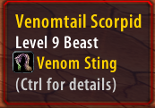
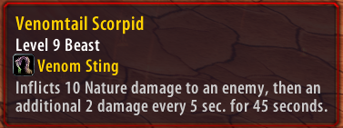

# Acer-Bestiary-Octo

A lightweight Octo WoW addon that automatically displays NPC abilities, icons, and detailed spell descriptions directly in the default Blizzard tooltip.

## Features

- **NPC Ability Detection**
  - Automatically detects known abilities associated with NPCs.
  - Works generically across NPCs rather than requiring individual NPC configurations.

- **Blizzard Default Tooltip Integration**
  - Displays ability information directly inside the standard Blizzard unit tooltip.
  - Does not require a separate custom tooltip window.

- **Ability Icons**
  - Displays the appropriate spell/ability icon alongside the ability name.
  - Uses available Octo WoW spell data to resolve icons automatically.

- **Ability Names**
  - Displays the actual spell/ability name rather than internal spell IDs or database identifiers.

- **Ctrl-to-Expand Details**
  - Normal NPC tooltips show a compact ability list.
  - Hold **Ctrl** to expand abilities and display their full descriptions.
  - Release **Ctrl** to return to the compact view.
  - NPCs with no detected abilities do not display the Ctrl-for-details prompt.

- **Automatic Spell Description Resolution**
  - Retrieves spell descriptions from available Octo WoW/Nampower spell data.
  - Does not require manually entering descriptions for individual abilities.

- **Dynamic Tooltip Updates**
  - The tooltip updates when Ctrl is pressed or released while hovering an NPC.
  - No need to move the mouse away and back onto the NPC to change detail mode.

## Commands

- `/cb` - Displays the current ClassicBestiary status and available commands.
- `/cb reset` - Resets ClassicBestiary's saved settings to their defaults.
- `/cb on` - Enables ClassicBestiary.
- `/cb off` - Disables ClassicBestiary.
- `/cb debug` - Toggles debug output in the chat window. This is primarily useful for troubleshooting NPC ability detection and spell data.